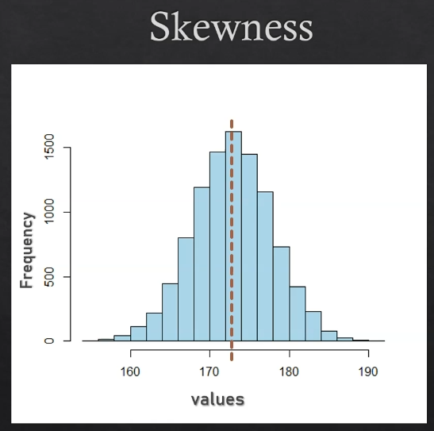
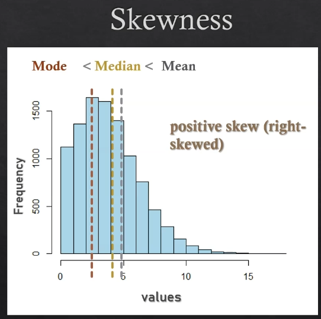
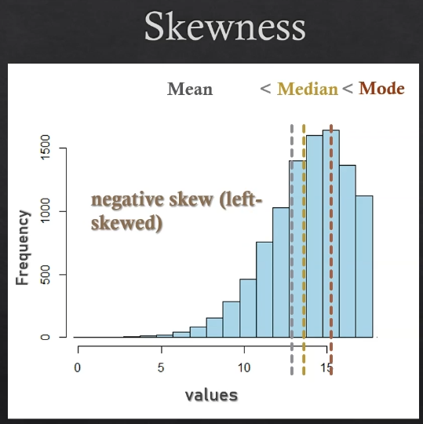
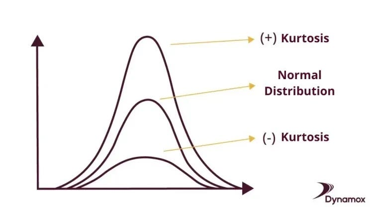

# Descriptive Statistics

Use measures and graphs to describe features of a dataset.

### Measures of Central Tendency

**Measures of central tendency:** Try to find a somewhat central/typical value in a dataset.  
**Measure of spread:** Should tell us how spread out or how dispersed are our values in a dataset.

### 1. Measures of Central Tendency

Help us to find a central value in a dataset. The most common measures of central tendency are:

#### Mean

Help us estimate the average value we can expect in other similar instances of a dataset.

$$\text{Mean} = \frac{\text{Suma de observaciones}}{\text{Numero de observaciones}}$$

$$\bar{x} = \frac{\sum_{i=1}^{n} x_i}{n}$$

#### Median

The value that separates the higher half from the lower half of a data set when it is ordered.

$$
\text{Med}(X) =
\begin{cases}
    X\left[\frac{n+1}{2}\right], & \text{if } n \text{ is odd} \\
    \frac{X\left[\frac{n}{2}\right] + X\left[\frac{n}{2} + 1\right]}{2}, & \text{if } n \text{ is even}
\end{cases}
$$

**Where:**

$$
X = \text{ordered list of values in the dataset} \\
n = \text{number of values in the dataset}
$$

#### Mode

The value that appears most frequently in a data set. If a mode value does not exist (have 2 or more mode values), we say that the dataset is multimodal or has no mode. Also, a dataset can be unimodal, bimodal, or multimodal.

$$
\text{Mode} = \text{value that appears most frequently in the dataset}
$$

#### Mean vs Median (When to use each?)

We use the mean when we have a symmetric distribution, and we use the median when we have a skewed distribution.

- Skewed distribution: The mean is affected by outliers.
- Symmetric distribution: The mean is not affected by outliers.

Example: Product price

<!-- Table of prices in the middle -->
<div align="center" >

| Price |
| ----- |
| 21    |
| 4     |
| 9     |
| 14    |
| 29    |
| 2     |

</div>

In this case the `Mean` is 39, where there is only one number higher than that, so we can say that the mean is not a good measure of central tendency for this dataset. **_This is because the mean is affected by outliers._**

- **Mean:** Is sensitive to outliers.
- **Median:** Is not sensitive to outliers.

So we use the `median` getting the value in the middle of the dataset, which is 14. For this case is better because it is not affected by the outliers and we get 50% of the data below and 50% above.

#### Skewness

Skewness is a measure of the asymmetry of the probability distribution of a real-valued random variable about its mean. The skewness value can be positive, zero, negative, or undefined.

<div align="center">
	
</div>

- Positive skewness: The tail on the right side of the distribution is longer or fatter than the left side.

<div align="center">
	
</div>

- Negative skewness: The tail on the left side of the distribution is longer or fatter than the right side.

<div align="center">
	
</div>
<!-- Formula of skewness -->

Also we can calculate the value of the skewness using the following formula:

<!-- formula with skew symbol u_3-->

$$
\tilde{\mu}_3 = \frac{\sum_{i=1}^{n} (x_i - \bar{x})^3}{(n-1) \cdot s^3}
$$

**Where:**

$$
x_i = \text{value of the dataset} \\
\bar{x} = \text{mean} \\
s = \text{standard deviation} \\
n = \text{number of values in the dataset}
$$

And standard deviation is:

$$
s = \sqrt{\frac{\sum_{i=1}^{n} (x_i - \bar{x})^2}{n}}
$$

In code python is calculated as follows:

```python
import numpy as np

# Generate random data
data = np.random.normal(0, 1, 1000)

# Calculate mean and sample standard deviation
mean = np.mean(data)
std_dev = np.std(data, ddof=1)  # Sample standard deviation (n-1)

# Calculate skewness (tilde(mu)_3)
n = len(data)
skewness = (np.sum((data - mean)**3) / (n - 1)) / (std_dev**3)

print("Skewness (tilde(mu)_3):", skewness)
```

If the skewness is $$\tilde{\mu}_3 = 0$$, then the data is perfectly symmetrical. If $$ \tilde{\mu}\_3 > 0 $$, then the data is positively skewed. If $$ \tilde{\mu}\_3 < 0 $$, then the data is negatively skewed.

### 2. Measures of Spread or Dispersion

Help us to find how spread out or how dispersed are our values in a dataset. The most common measures of spread are:

#### Range and Interquartile Range (IQR)

**Range:** The difference between the maximum and minimum values in a dataset. this help us to find the spread of the data.

$$
\text{Range} = \text{Max} - \text{Min}
$$

**IQR:** The difference between the 75th percentile (Q3) and the 25th percentile (Q1) in a dataset. This help us to find the range of the middle 50% of the data.

$$
\text{IQR} = Q3 - Q1
$$

#### Sample vs Population

- **Sample:** A subset of the population.
  - Average: $$\bar{x}$$
  - Size: $$n$$
  - Variance: $$s^2$$
- **Population:** The entire dataset.
  - Average: $$\mu$$
  - Size: $$N$$
  - Variance: $$\sigma^2$$

The idea of using samples is to avoid the cost of collecting data from the entire population. Also, the sample is used to estimate the population parameters.

#### Variance and Standard Deviation

This two metrics of dispersion are more robust than the range, because they consider all the values in the dataset. But they are not robust to outliers (more sensitive to outliers).

There is differences between the **variance** and **standard deviation** in **population** and **sample**.

- **Population Variance**

$$
\sigma^2 = \frac{\sum_{i=1}^{N} (x_i - \mu)^2}{N}
$$

**Explanation:** We applied $$ \sum\_{i=1}^{N} (x_i - \mu)^2 $$ for calculate something call **Mean Centering** which is the difference between the value and the mean, to find how spreed is our dataset from the **Mean**. Then we square this difference to avoid negative values and finally we divide by the number of values in the dataset to get the average of the squared differences. Also the square makes the values more dispersed have more weight in the calculation.

- **Sample Variance**

$$
s^2 = \frac{\sum_{i=1}^{n} (x_i - \bar{x})^2}{n-1}
$$

**Explanation:** The same as the population variance but we divide by $$ n-1 $$ instead of $$ N $$ is the so called **Degree of Freedom**, which tell us that we only need to know $$ n-1 $$ values to know the the last value if we know the mean and this is called **Corrected Sample** because we are correcting the sample variance to be more close to the population variance and is a better estimator that the population variance.

- **Population Standard Deviation**

$$
\sigma = \sqrt{\sigma^2}
$$

- **Sample Standard Deviation**

$$
s = \sqrt{s^2}
$$

There is no big difference between the formulas of the variance and standard deviation, the only difference is that the standard deviation is the square root of the variance. The reason for this is that the standard deviation is in the same units as the data, while the variance is in squared units. So the standard deviation is more interpretable than the variance.

### 3. Impact of Scaling and Shifting

The scaling and shifting of data can affect the measures of central tendency and dispersion.

- **Scaling:** Multiply or divide all the values in a dataset by a constant.
- **Shifting:** Add or subtract a constant to all the values in a dataset.

If we scale the data, the measures of central tendency and dispersion will change. But if we shift the data, the measures of central tendency will change, but the measures of dispersion will remain the same.

**Example**:

When we shift by n:

$$
\begin{align*}
\text{Mean} & : \bar{x} \rightarrow \bar{x} + n \\
\text{Median} & : \text{Median} \rightarrow \text{Median} + n  \\
\text{Mode} & : \text{Mode} \rightarrow \text{Mode} +  n \\
\text{Range} & : \text{No change} \\
\text{IQR} & : \text{No change} \\
\text{Variance} & : \text{No change} \\
\end{align*}
$$

When we scale by n:

$$
\begin{align*}
\text{Mean} & : \bar{x} \rightarrow n \cdot \bar{x} \\
\text{Median} & : \text{Median} \rightarrow n \cdot \text{Median}  \\
\text{Mode} & : \text{Mode} \rightarrow n \cdot \text{Mode} \\
\text{Range} & : \text{Range} \rightarrow n \cdot \text{Range} \\
\text{IQR} & : \text{IQR} \rightarrow n \cdot \text{IQR} \\
% Variance has a special formula
\text{Variance} & : \sigma^2 \rightarrow n^2 \cdot \sigma^2 \\
\end{align*}
$$

#### Statistical Moments

The statistical moments are just generalizations about our measures of central tendency and dispersion.

**General Formula:**

$$
m_k = \frac{\sum_{i=1}^{n} (x_i - \bar{x})^k}{n}
$$

**Where:**

$$
x_i = \text{value of the dataset} \\
\bar{x} = \text{mean} \\
n = \text{number of values in the dataset}
$$

This is also called **Unstandardized Moments**. The problem in practice is that the higher the value of k, the more sensitive the moment is to outliers. Therefore we use the standardized moments with **Standardized Moments**:

**Mean - Center:**

$$
\mu_k = \frac{1}{n} \sum_{i=1}^{n}x_i
$$

**Variance - Spreed**

$$
\mu_2= \frac{1}{n} \sum_{i=1}^{n}(x_i - \bar{x})^2
$$

**Skewness - Dispersion Asymmetry**

$$
\mu_3= \frac{1}{n\sigma^3} \sum_{i=1}^{n}(x_i - \bar{x})^3
$$

**Kurtosis - Dispersion Tails**: The kurtosis is a measure of the "tailedness" of the probability distribution of a real-valued random variable. Able to us to see how heavy the data is in the tails. Also give us information about the shape of the distribution.

$$
\mu_4= \frac{1}{n\sigma^4} \sum_{i=1}^{n}(x_i - \bar{x})^4
$$

If the kurtosis is positive, the tails are heavier than the normal distribution. If the kurtosis is negative, the tails are lighter than the normal distribution.

<div align="center">
	
</div>

This help us to see the shape of the distribution of the data.
