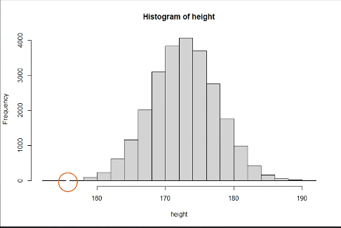
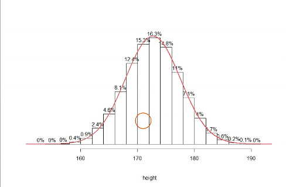
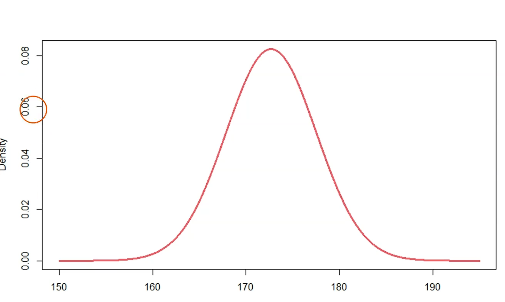

# Distributions

## What is a distribution?

It's just about how often do certain values occur in a dataset

Also you can visualize it with percentages, this help you to understand the data better, using the areas of the bars to represent the percentage of the data that falls into each category.

First you have to find a curve that fits the data, and then you can use it to calculate the probability of a certain value.
In this case we have a normal distribution, which is a bell-shaped curve.And we can use the mathematical formula of normal distribution to calculate the percentage of a certain value.

>`bell-shaped` means that the highest point is in the middle and the curve goes down symmetrically on both sides.

So we use something call **Density Function** of the theorical distribution. Also something important is that the area under the curve is 1. This is because the total probability of all possible outcomes is 1. And you can calculate the area using the integral of the density function.

> Each type of distribution has its own density function.
